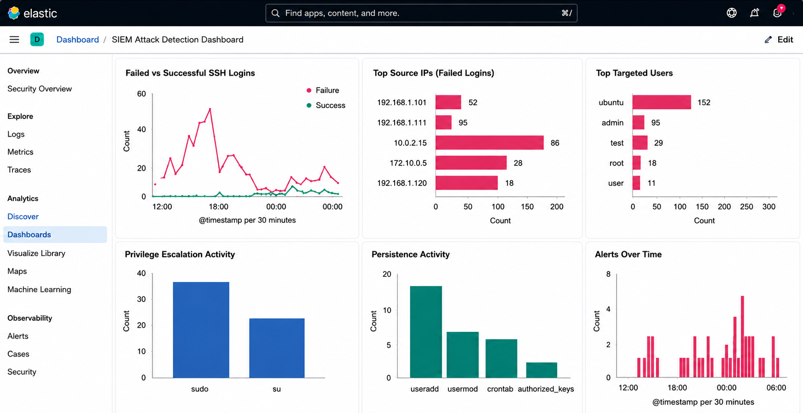
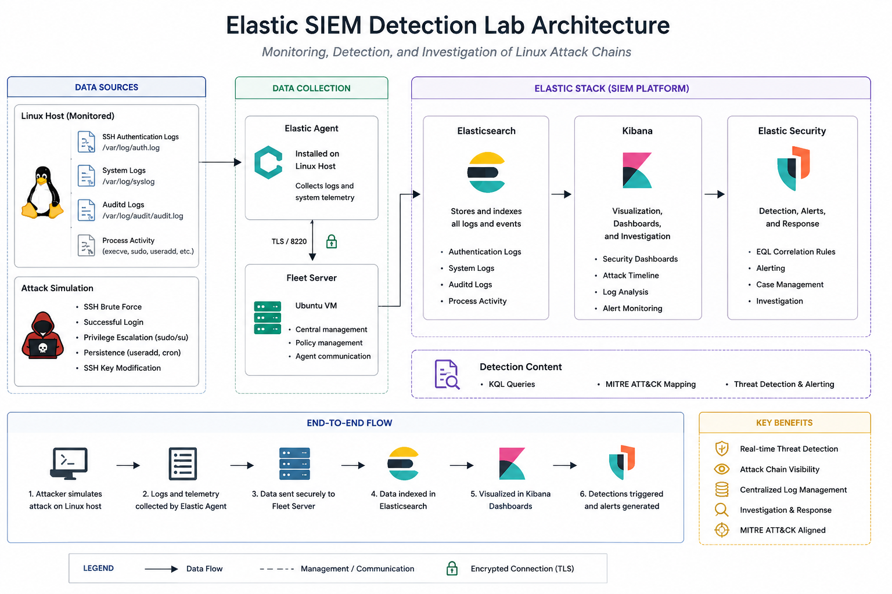
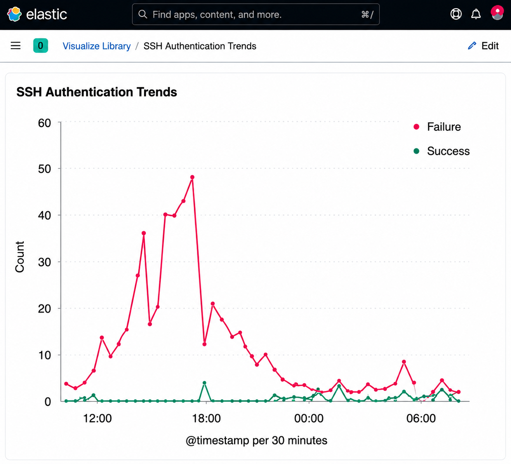
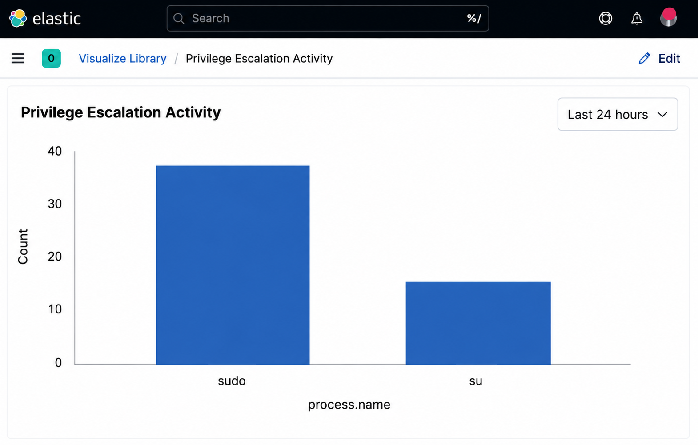
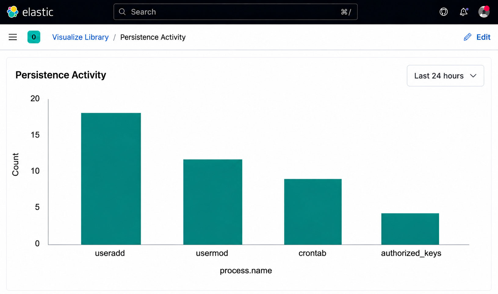
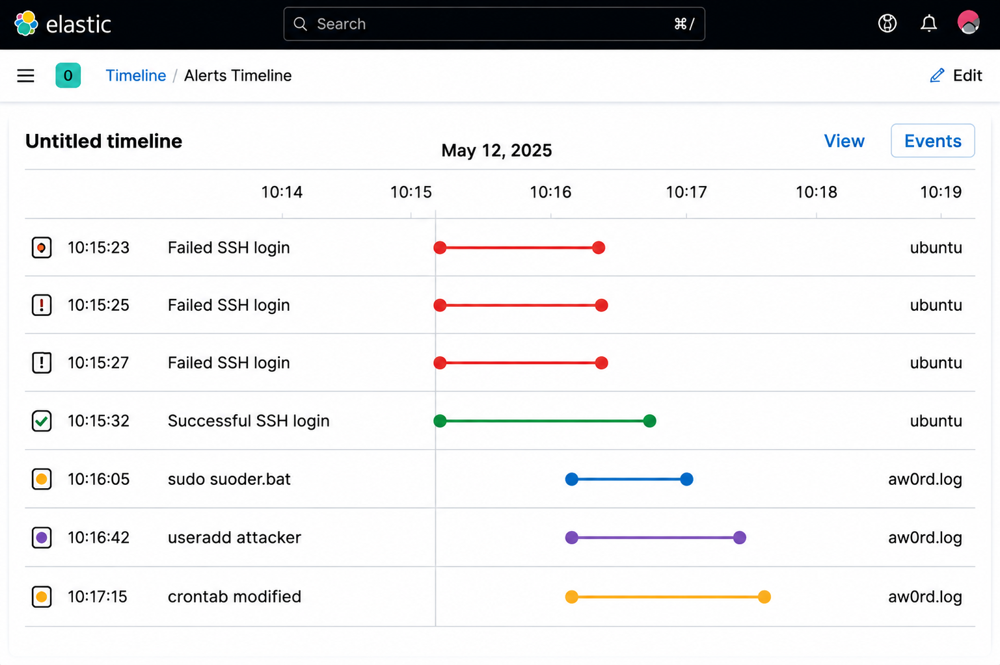
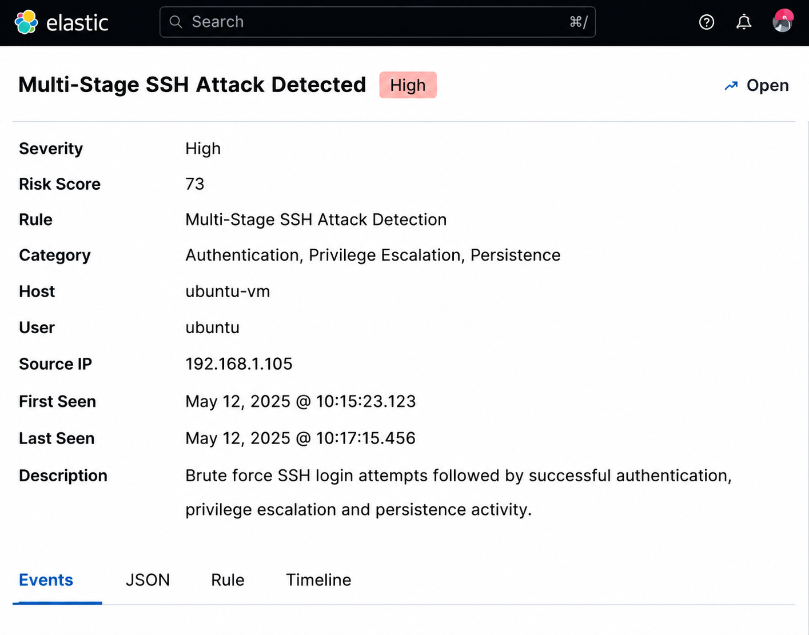

# Elastic SIEM Detection Engineering Lab  
### Multi-Stage Attack Simulation, Correlation Rules, and Security Monitoring

<p align="center">
  
</p>

---

## Overview

This project demonstrates the design and implementation of a Detection Engineering Lab using the Elastic Stack to simulate and detect real-world attack behavior in a controlled environment.

The lab focuses on:
- SSH brute force detection
- Correlation-based attack chain detection
- Privilege escalation monitoring
- Persistence detection
- Dashboard-driven investigation workflows

The environment uses Elastic SIEM with Fleet and Elastic Agent to ingest Linux authentication and process activity logs for analysis and detection engineering.

---

# Architecture

<p align="center">
  
</p>

### Infrastructure

| Component | Purpose |
|---|---|
| Ubuntu VM | Fleet Server |
| Linux Host | Elastic Agent Endpoint |
| Elasticsearch | Log storage and indexing |
| Kibana | SIEM dashboards and investigation |
| Auditd | Linux process auditing |

---

# Technologies Used

- Elastic Stack (Elasticsearch + Kibana)
- Fleet Server
- Elastic Agent
- Linux Auditd
- EQL (Event Query Language)
- KQL (Kibana Query Language)
- Ubuntu Linux

---

# Attack Scenarios Simulated

This lab simulates a realistic SSH-based attack chain.

---

## 1. SSH Brute Force Attack

Repeated failed login attempts were generated:

```bash
ssh fakeuser@localhost
```

### Detection Goal
Detect multiple failed SSH login attempts from the same source.

---

## 2. Successful Authentication After Brute Force

```bash
ssh validuser@localhost
```

### Detection Goal
Correlate successful authentication following repeated failures.

---

## 3. Privilege Escalation

```bash
sudo su
```

### Detection Goal
Identify escalation from normal user context into elevated privileges.

---

## 4. Persistence Techniques

### User Creation

```bash
sudo useradd attacker
```

### Cron Persistence

```bash
crontab -e
```

### Detection Goal
Detect persistence-related process activity.

---

# Detection Engineering

The lab uses EQL correlation rules to detect multi-stage attacker behavior.

---

## SSH Brute Force → Successful Login Correlation

```eql
sequence by source.ip, user.name with maxspan=10m
  [authentication where event.outcome == "failure"]
  [authentication where event.outcome == "failure"]
  [authentication where event.outcome == "failure"]
  [authentication where event.outcome == "success"]
```

---

## Full Attack Chain Correlation Rule

```eql
sequence by host.id, source.ip, user.name with maxspan=20m

  [authentication where event.outcome == "failure"]
  [authentication where event.outcome == "failure"]
  [authentication where event.outcome == "failure"]

  [authentication where event.outcome == "success"]

  [process where process.name in ("sudo", "su")]

  [process where process.name in ("useradd", "usermod", "crontab")]
```

---

# MITRE ATT&CK Mapping

| Attack Stage | MITRE Technique | ID |
|---|---|---|
| Brute Force | Credential Access | T1110 |
| Valid Accounts | Initial Access | T1078 |
| Privilege Escalation | Abuse Elevation Control Mechanism | T1548 |
| Persistence | Account Manipulation | T1098 |
| Persistence | Scheduled Task / Cron | T1053 |

Aligned with :contentReference[oaicite:0]{index=0} techniques.

---

# Kibana Dashboards

The project includes dashboards for monitoring and investigation workflows.

---

## Authentication Monitoring

Tracks:
- Failed SSH logins
- Successful SSH logins
- Authentication spikes
- Top attacker IPs

<p align="center">
  
</p>

---

## Privilege Escalation Monitoring

Tracks:
- sudo execution
- su execution
- Elevated command usage

<p align="center">
  
</p>

---

## Persistence Activity

Tracks:
- useradd
- usermod
- cron modifications

<p align="center">
  
</p>

---

## Attack Timeline Investigation

Correlates:
- Failed logins
- Successful authentication
- Privilege escalation
- Persistence activity

<p align="center">
  
</p>

---

# Detection Alerts

Elastic Security alerts generated from correlation rules.

<p align="center">
  
</p>

---

# Investigation Workflow

This lab demonstrates a realistic SOC investigation workflow:

1. Detect brute force activity
2. Identify attacker IP
3. Correlate successful login
4. Investigate privilege escalation
5. Confirm persistence activity
6. Review attack timeline
7. Trigger alert and investigate affected host

---

# Data Sources

| Dataset | Purpose |
|---|---|
| system.auth | SSH authentication events |
| auditd.log | Linux process execution |
| system.metrics | Host monitoring |

---

# Challenges & Solutions

## Challenge: Missing Process Visibility

### Problem
Initial setup lacked process-level telemetry.

### Solution
Installed and configured Linux Auditd:

```bash
sudo apt install auditd audispd-plugins -y
sudo auditctl -a always,exit -F arch=b64 -S execve
```

---

## Challenge: Log Parsing & Normalization

### Problem
Some authentication logs were initially ingested as raw syslog messages.

### Solution
Adjusted Fleet integrations and validated ECS-compatible fields for detection engineering.

---

# Skills Demonstrated

- SIEM Engineering
- Detection Engineering
- EQL Correlation Rules
- Log Analysis
- Security Monitoring
- Linux Auditing
- Threat Hunting
- MITRE ATT&CK Mapping
- Dashboard Development
- Incident Investigation

---

# Repository Structure

```text
elastic-siem-detection-lab/
│
├── README.md
│
├── architecture/
│   ├── diagram.png
│   └── lab-setup.md
│
├── detections/
│   ├── brute_force_detection.eql
│   ├── attack_chain_detection.eql
│   └── persistence_detection.kql
│
├── simulations/
│   ├── ssh_bruteforce.md
│   ├── privilege_escalation.md
│   └── persistence_simulation.md
│
├── dashboards/
│   ├── dashboard_export.ndjson
│   └── screenshots/
│
├── screenshots/
│   ├── alerts/
│   ├── kibana/
│   └── attack_timeline/
│
└── reports/
    └── detection_engineering_report.pdf
```

---

# Future Improvements

- GeoIP attack source visualization
- Machine learning anomaly detection
- Command-and-control detection scenarios
- Windows endpoint telemetry
- Sigma rule conversion
- Case management workflows

---

# Author

Molly Sohaney  
Computer Science @ UGA  
Cybersecurity & Privacy Certificate Program
